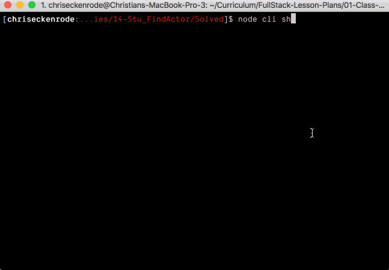

# CLI

In this activity we will write the CLI portion of the TV Search application.

## Instructions

* When the completed `cli.js` file is run with node, it should be able to handle command line arguments similar to those below:

  ```
  // Search for The Andy Griffith Show

  node cli show The Andy Griffith Show
  ```

  and

  ```
  // Search for the actor Andy Griffith

  node cli actor Andy Griffith
  ```

* In these examples the cli expects input in the following format:

  ```
  node cli <show-or-actor> <actor-or-show-name>
  ```



* To begin, open [cli.js](Unsolved/cli.js) and write code to store the `<show-or-actor>` command line argument in a variable named `search`.

* Store the `<actor-or-show-name>` command line argument in a variable named `term`. Keep in mind that this argument may contain spaces so it may span multiple indexes of `process.argv`. Check out the [Array Slice Method](https://developer.mozilla.org/en-US/docs/Web/JavaScript/Reference/Global_Objects/Array/slice) to achieve this.

* Then write an if/else statement to print to the console whether a show or actor is being searched for.

* We will add some functionality to actually perform the API calls in the next activity.

### Bonus

* Write logic to set up a default search type and default term if either are missing.
