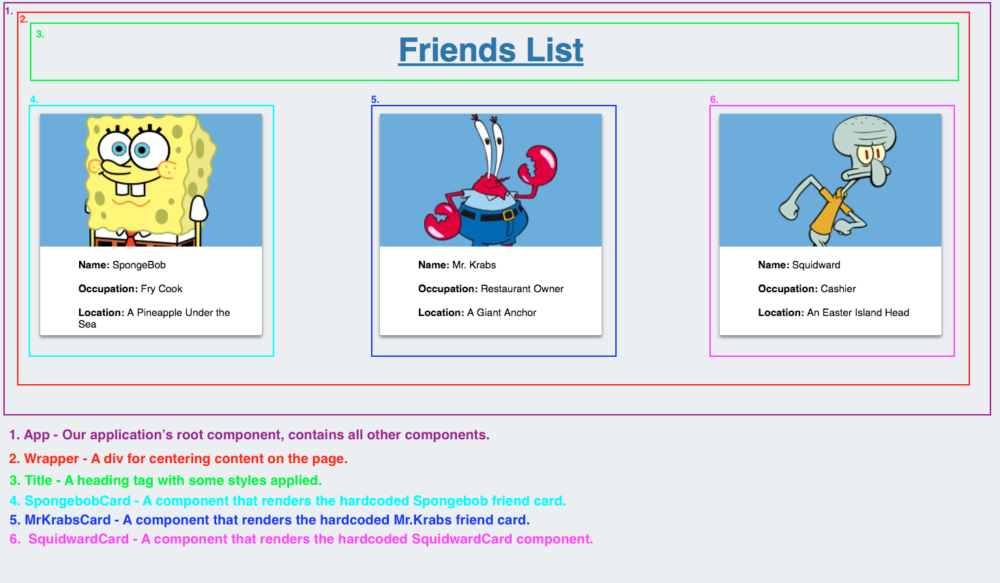
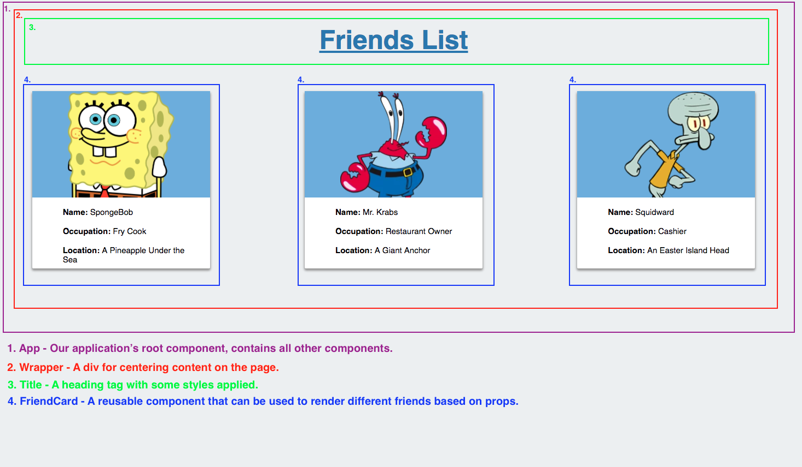

# Props

In this activity, we will modify a React application to make it more DRY through the use of props.

## Instructions

* Replace your Create React App's `src` folder with the provided [src](Unsolved/src) folder.

* Stop the dev server if it is already running. Start the app in dev mode by running `npm start`. Open [localhost:3000](http://localhost:3000) in your web browser and take a moment to study the rendered app.

  

  * This application is the start of a friends list for a social network.

* Open `src/App.js` in your editor and notice how the `SpongebobCard`, `MrKrabsCard`, and `SquidwardCard` are being rendered inside of `Wrapper`, which is in turn being rendered inside of the `App` component.

* Open up each component's files in turn and briefly study the JSX being returned by each. Most importantly, notice how all of the card components render very similar JSX. This isn't very DRY code. **We'll fix this by creating a brand new `FriendCard` component and rendering it once for each friend. We'll pass down the differentiating content in the form of props.** 

  

* Take a moment to study the `src/friends.json` file. This file contains the data that makes each friend card unique from one another. We'll use this file to pass props down to our new `FriendCard` component.

* Import the `src/friends.json` file into `src/App.js`. This can be achieved with the following syntax: 

  ```js
  import friends from "./friends.json";
  ```

* Inside of `src/App.js`, remove the imports for each friend's card, and remove the JSX rendering each card inside of this file.

* Create a brand new component named `FriendCard`.

  * The `FriendCard` component can initially contain the same code as `SpongebobCard` with the same CSS file.

  * Require the `FriendCard` component inside of `src/App.js` and render it inside of the `Wrapper` component. Before going any further, check your browser. If successful, you should only see one card being rendered.

* Still inside of `src/App.js`, use the first friend object in the `friends` JSON file to pass the following props down to your rendered `FriendCard` component.

  * `name`

  * `image`

  * `occupation`

  * `location`

* Modify the `FriendCard` component so that it accepts and renders all of the passed props in place of the currently hard coded values. Once complete, check your browser to make sure the first `FriendCard` is still being properly rendered.

* Inside of `src/App.js`, render another `FriendCard` component for the second and third piece of friend data. Pass down the appropriate JSON data for each as props. If successful, you should see each friend being rendered to the browser, utilizing the same same `FriendCard` component three times.

### Hints

* Check out [React's documentation on components & props](https://facebook.github.io/react/docs/components-and-props.html) 
